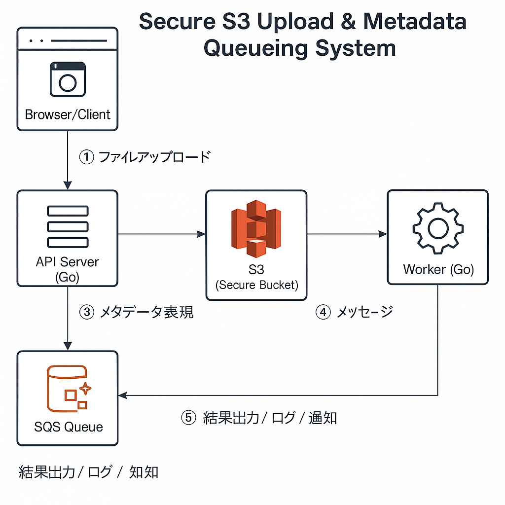

# Secure S3 Upload & Metadata Queueing System

## 📌 概要
本プロジェクトは、法人向けの請求書保管SaaSを想定した、セキュアなファイルアップロードと非同期処理のアーキテクチャ設計・PoCです。

- アップロードされたファイルは S3 に保存されます
- メタデータは SQS に送信され、バックグラウンド処理に利用されます
- 今後はLambdaやワーカーでOCR、PII検知なども可能

## 🧱 アーキテクチャ

## 🚀 機能

| モジュール       | 内容 |
|------------------|------|
| uploader         | クライアントがファイルをアップロード（S3保存 & SQS送信） |
| sqs-worker       | メタデータを取り出してログに記録 or 処理 |
| s3/client.go     | AWS SDKでのS3 PutObject処理 |
| sqs/client.go    | SQSへのSendMessage & ReceiveMessage |

## ⚙️ 使用技術

- Go 1.20+
- AWS SDK for Go v2
- S3, SQS（ローカルでも使えるよう interface化）
- セキュリティ対策としてバケットACL制限, SSE-KMSを想定

## 💡 今後の発展

- JWTによるAPI認証
- Lambda化によるスケーラブルな構成
- ファイル内容のPIIスキャン（OCR, Comprehend）
